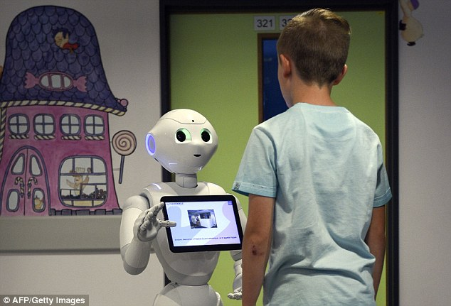

# Project Pepper

{:style="float: right; width: 300px;"}
Het LUMC en het lectoraat voor Health and Technology wil onderzocht hebben hoe een interactieve robot (Pepper) kan worden ingezet in het revalidatietraject van patiënten die een gewrichtsoperatie hebben ondergaan, bv een knie- of schouderoperatie. Deze patiënten moeten bijvoorbeeld elk uur specifieke oefeningen doen om snel te revalideren. In praktijk doen veel patiënten deze oefeningen vaak niet of niet correct waardoor ze langer in het ziekenhuis moeten blijven. Dat is slecht voor de patiënt, de wachtlijsten en het ziekenhuis. Het idee is dat een robot langs de patiënt gaat om instructie te geven, te observeren of de oefening correct wordt uitgevoerd, eventueel bij te sturen, en verslag uit te brengen naar de arts hoe ver de patiënt in het revalidatietraject is. In deze eerste 20 weken is het doel om te herkennen of oefeningen correct worden uitgevoerd.

