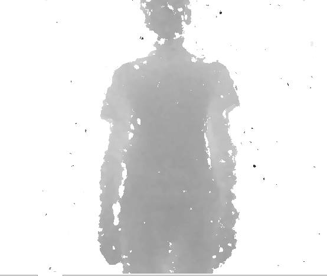
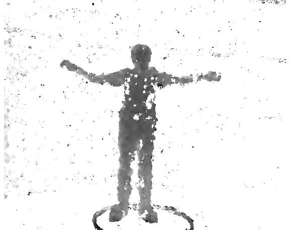

# Project Pepper

[{:style="float: right; width: 300px;"}](pepper.jpg)
Het LUMC en het lectoraat voor Health and Technology wil onderzocht hebben hoe een interactieve robot (Pepper) kan worden ingezet in het revalidatietraject van patiënten die een gewrichtsoperatie hebben ondergaan, bv een knie- of schouderoperatie. Deze patiënten moeten bijvoorbeeld elk uur specifieke oefeningen doen om snel te revalideren. In praktijk doen veel patiënten deze oefeningen vaak niet of niet correct waardoor de revalidatie minder goed verloopt. Dat is slecht voor de patiënt, de wachtlijsten en het ziekenhuis. Het idee is dat een robot langs de patiënt gaat om instructie te geven, te observeren of de oefening correct wordt uitgevoerd, eventueel bij te sturen, en verslag uit te brengen naar de arts hoe ver de patiënt in het revalidatietraject is. In deze eerste 20 weken is het doel om te herkennen of oefeningen correct worden uitgevoerd.

## 8 sept 2017
We zijn nu twee weken met veel enthousiasme bezig! Ons team bestaat uit een docent en 7 studenten met verschillende achtergronden (Informatica, Bedrijfskunde, Bedrijfskundige Informatica, Toegepaste Wiskunde). Om voor onszelf tot een haalbare doelstelling te komen, focussen we ons op het schoudergewricht. We willen dus onderzoeken of een pepper robot de oefeningen kan monitoren die patiënten na een schouderoperatie moeten uitvoeren.

De pepper robot is voorzien van een diepte camera die gebruikt maakt van de Intel RealSense libraries. Uit de literatuur weten we ondertussen dat het met vergelijkbare hardware (Kinect) mogelijk is om voldoende naukeurige beelden op te nemen. De standaard software die de Kinect aan boord heeft lijkt op dit punt wel verder ontwikkeld dan de RealSense software. Dat is dus een punt van aandacht.
Aangezien deze literatuur gebruik maakt van skeleton functies, die van een persoon een draadmannetje maken, focust ons onderzoek ons op dit moment op twee punten:
1. Het zoeken naar openbaar beschikbare skeleton algoritmes.
1. Het opnemen van testbeelden en hier handmatig metingen aan proberen te doen.

We hebben ondertussen skeleton algoritmes gevonden, en zijn bezig die op onze eigen systemen te proberen te compileren. [Hier](https://forum.openframeworks.cc/t/openni-skeleton-tracking/5125/2) is een voorbeeld op internet van een van de gevonden algoritmes. Zover proberen wij dus ook te komen.

Wij hebben met een los aangeschafte Realsense camera (dus nog even zonder Pepper robot eromheen) beelden kunnen opnemen. We zien dat de resolutie van de beelden niet direct zo goed is dat we overtuigd zijn dat metingen betrouwbaar zullen zijn. We zijn dus aan het experimenteren met verschillende instellingen. 
Hier twee voorbeelden. Op het eerste voorbeeld een opnamne op 1 meter afstand.

[{:style="float: left; width: 300px;"}](1meter1frames.jpg)

Op het twede voorbeeld was de afstand 3 meter, en zijn om een beter beeld te krijgen 10 frames samengenomen.

[{:style="float: left; width: 300px;"}](3meter10frames.jpg)
