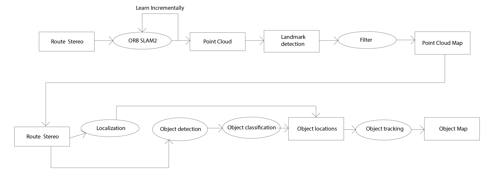

# Project Urbinn

[{:style="float: right; width: 300px;"}](urbinn.png)
Binnen het project Urbinn wordt een duurzame zelfrijdende stadsauto ontwikkeld door een samenwerkingsverband van o.a. de Betafactory, Accenda, het lectoraat Smart Sensor Systems, 6 faculteiten van de HHS, TU Delft en Accenda. De bijdrage aan Urbinn vanuit KB-74 is om camera beelden te gebruiken om de exacte positie en richting van de auto te bepalen en vaste en bewegende obstakels te classificeren zodat deze informatie in een vervolgtraject kan worden gebruikt om het autonoom rijden te onderzoeken.

Milestone 1 - Orientatie project
----------

In de eerste week hebben we ons georienteerd op de opdracht. Voor een inschatting van de locatie en het mappen van de omgeving worden Simultaneous Localization and Mapping (SLAM) algoritmes gebruikt. Die kunnen werken met verschillende sensoren zoals LIDAR, SONAR, aucoustisch en/of camera beelden. Omdat we in een volgende stap moeten herkennen wat het object is lijken camera beelden in ieder geval nodig. Bij het verkennen van SLAM-algoritmes blijken stereo camera beelden behoorlijk acurate resultaten op te leveren in real-time.

Er bestaan veel verschillende SLAM-algoritmes, die in veel gevallen het resultaat zijn van wetenschappelijk onderzoek. Op de site van de [KITTI Dataset](http://www.cvlibs.net/datasets/kitti/eval_odometry.php) staat een vergelijking van de verschillende algoritmes. We hebben een vooropige selectie gemaakt van de meest interessante algoritmes op basis van de resultaten, kwaliteit van de beschrijving, de beschikbaarheid van open source en de mate van ondersteuning. Voorlopig gaan we aan de slag met [SVO](https://www.google.nl/url?sa=t&rct=j&q=&esrc=s&source=web&cd=3&cad=rja&uact=8&ved=0ahUKEwjb_Z26m5PWAhXNZVAKHRQmBBAQFgg4MAI&url=http%3A%2F%2Frpg.ifi.uzh.ch%2Fdocs%2FICRA14_Forster.pdf&usg=AFQjCNH7yos-_jmOo3WUp8tUGLP-z9Jppw) en [ORB2](https://arxiv.org/abs/1610.06475).

Een voorbeeld van ORB2 SLAM op de KITTI Dataset (klik voor video) 

Milestone 2 - ORB localization gang Slinger/Kitti
----------

In week 3 zijn we begonnen met het maken van de eigen dataset gebasseerd op de gang (Slinger) van de Haagse Hogeschool. Onze milesstone voor sprint 2 is het mogelijk maken om middels onze eigen dataset of de KITTI dataset in te kunnen laden in het ORB-SLAM2 algoritme.
ORB-SLAM2 is inmiddels geinstalleerd op de server waarmee we de eerste testen hebben gedraaid. Daarnaast zijn er twee nieuwe groepsleden toegevoegd aan het Urbinn project die het totaal aantal leden op 10 brengt. We experimenteren met verschillende soorten camera's om te bepalen welke settings (fps, resolutie, etc) het beste en meest geschikt zijn voor dit project. 
Ook is het inmiddels mogelijk om de pointcloud van de map op te slaan waarmee het mogelijk moet worden om een semantische map van de omgeving te kunnen creëren. Tot slot is er gewerkt aan de juiste kalibratie van de camera's.   

Inmiddels is het week 4 en is einde van sprint 2 in zicht. De milestone van sprint 2 is voor het grootste deel behaald. Wij zijn in staat om de KITTI testdataset in te laden in het ORB-SLAM2 algoritme en een pointcloud te kunnen creëren aan de hand van de data. Tevens is het ons ook gelukt om de pointcloud op te slaan en opnieuw in te laden. Op dit moment zijn wij bezig om de afstanden in kaart te brengen tussen de keyframes en de orbs. Hierdoor is het mogelijk om diepte aan te geven van objecten in een bepaald frame. 
Verder hebben wij twee camera's gekalibreerd en zijn de eerste stereo videobeelden opgenomen van de gang (Slinger) van de Haagse Hogeschool. Dit is gedaan om deze dataset toe te passen met het ORB-SLAM2-algoritme.
Tot slot zijn de eerste voorbereidende stappen ondernomen voor milestone 3 (Milestone 3 - Object detection gang Slinger/Kitti). Wij hebben 2 intressante frameworks onderzocht betreffende real time object detection namelijk, [YOLO](https://github.com/pjreddie/darknet/wiki/YOLO:-Real-Time-Object-Detection) en [Fast R-CNN](https://github.com/rbgirshick/fast-rcnn).

Milestone 3 - Object detection gang Slinger/Kitti
----------	

Om milestone 3 te behalen zijn we begonnen met het onderzoeken van verschillende frameworks voor object detection en recognition. De belangrijkste eis is dat het framework in real-time objecten kan detecteren en herkennen. Om deze reden hebben we voor het framework YOLO, You Only Look Once, gekozen. YOLO kan met 45 fps uitgevoerd worden. Er bestaat ook een snellere variant, FAST YOLO, die met 155 fps uitgevoerd kan worden. 
Na het testen van YOLO gaan we beginnen aan de pipeline. De pipeline bestaat uit ORB SLAM2 om diepte te bepalen en YOLO om objecten te detecteren en herkennen, zoals te zien is in het overzicht hieronder.  

          

Inmiddels is er ook een begin gemaakt aan het evaluatieplan. We gaan plattegronden en met laser gegenereerde point clouds gebruiken om de nauwkeurigheid van de pipeline en camera setup te bepalen. Op basis hiervan kunnen we de pipeline verbeteren.

Inmiddels is het einde van de sprint voor het behalen van milestone 3 in zicht. Er is een evaluatieplan opgesteld om de accuraatheid van point clouds gegenereerd m.b.v. visual stereo SLAM-setups vast te stellen. Ook zijn varianten van het YOLO-framework getest, namelijk Tiny YOLO (FAST YOLO) en YOLO 9000. Tiny YOLO is een snellere variant van YOLO doordat het achterliggende neurale netwerkt kleiner is. YOLO 9000 is juist een uitbreiding van het orignele framework omdat het maarliefst 9000 classificaties gebruikt in plaats van 20. Tijdens het testen is gebleken dat Tiny YOLO goed genoeg is voor object detectie en herkenning. Het is wel noodzakelijk om meer classificaties toe te voegen aan Tiny YOLO, zoals in het Tiny YOLO plaatje hieronder te zien is.

          

Verder is de pipeline gewijzigd door voortschrijdend inzicht in YOLO. Hieronder is het vernieuwde overzicht te zien.

